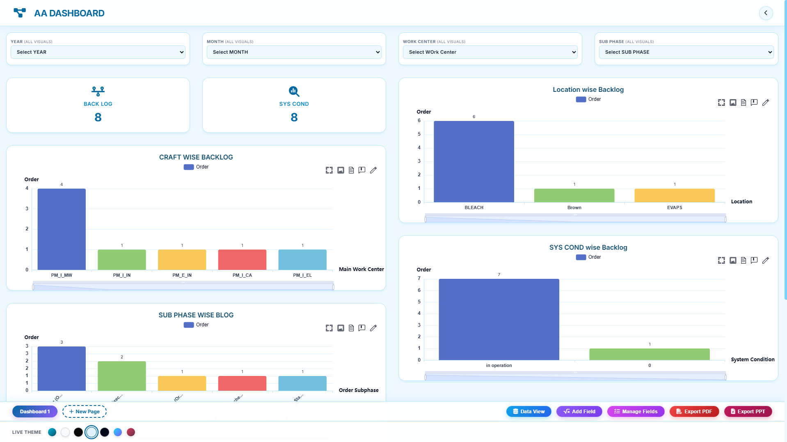

# 📊 AA Dashboard – Backlog Monitoring Dashboard

## 📌 Project Overview

The **AA Dashboard** is an interactive Power BI dashboard designed to monitor and analyze operational backlog data. It provides a centralized view of pending orders across multiple business dimensions, helping stakeholders identify bottlenecks, monitor workloads, and improve operational efficiency.

The dashboard enables users to analyze backlog distribution by Work Center, Location, System Condition, and Sub Phase through intuitive visualizations and interactive filters.

---

## 📷 Dashboard Preview

---

## 🎯 Project Objectives

- Monitor overall backlog performance.
- Analyze backlog distribution across work centers.
- Track pending orders by location.
- Evaluate backlog based on system conditions.
- Identify process bottlenecks through sub-phase analysis.
- Improve operational visibility and decision-making.
- Support resource planning and workload management.

---

## 📂 Data Source

This dashboard was developed using data stored in **Microsoft Excel**.

The Excel dataset was imported into Power BI and used for data cleaning, transformation, modeling, and visualization.

The project demonstrates the complete Power BI development workflow, including:

- Data Import from Excel
- Data Cleaning and Transformation using Power Query
- Data Modeling
- DAX Measure Creation
- Interactive Dashboard Design
- Business Insight Generation

> **Note:** The source Excel file is not included in this repository.

---

## 🛠️ Tools & Technologies Used

| Tool | Purpose |
|--------|----------|
| Microsoft Excel | Data Source |
| Power Query | Data Cleaning & Transformation |
| Data Visualization | Business Reporting & Analytics |

---

## 📊 Dashboard KPIs

### 🔹 Back Log
Displays the total number of pending backlog orders.

### 🔹 SYS COND
Represents the count of records categorized by system condition.

These KPIs provide a quick overview of operational workload and backlog status.

---

## 📈 Dashboard Features

### 1️⃣ Work Center Wise Backlog

Analyzes backlog distribution across different work centers.

#### Insights
- Identifies work centers with the highest pending workload.
- Helps optimize workforce allocation.
- Supports operational planning.

---

### 2️⃣ Location Wise Backlog

Displays backlog counts across different locations.

#### Insights
- Highlights locations with operational bottlenecks.
- Supports regional performance monitoring.
- Enables location-specific decision-making.

---

### 3️⃣ System Condition Wise Backlog

Analyzes backlog based on system condition categories.

#### Insights
- Provides visibility into operational health.
- Helps identify system-related challenges.
- Supports maintenance and process improvement initiatives.

---

### 4️⃣ Sub Phase Wise Backlog

Tracks backlog orders across different operational sub-phases.

#### Insights
- Identifies stages where delays occur.
- Helps improve workflow efficiency.
- Enables proactive backlog management.

---

## 🎛️ Interactive Filters

The dashboard includes dynamic slicers that allow users to perform detailed analysis.

### Available Filters

- Year
- Month
- Work Center
- Sub Phase

These filters help users drill down into specific operational segments and gain deeper insights.

---

## 📊 Key Business Insights

### Backlog Visibility
- Provides a centralized overview of pending orders.
- Enables quick identification of backlog concentrations.

### Workload Distribution
- Highlights work centers with higher backlog volumes.
- Assists in balancing operational workloads.

### Location Analysis
- Identifies locations requiring immediate attention.
- Supports regional planning and resource allocation.

### Process Monitoring
- Tracks backlog accumulation across different process stages.
- Helps identify bottlenecks and delays.

### Operational Efficiency
- Supports data-driven decision-making.
- Improves overall workflow transparency.

---

## 🚀 Business Impact

This dashboard helps organizations:

- Improve operational efficiency.
- Monitor pending workloads effectively.
- Reduce process delays.
- Optimize resource allocation.
- Identify bottlenecks quickly.
- Enhance decision-making through analytics.
- Improve operational performance and productivity.

---

## 📋 Key Learnings

During this project, I gained practical experience in:

- Data Cleaning using Power Query
- Data Transformation Techniques
- Data Modeling in Power BI
- DAX Measures and Calculations
- KPI Development
- Interactive Dashboard Design
- Operational Data Analysis
- Business Intelligence Reporting
- Data Storytelling and Visualization

---

## ⭐ Future Enhancements

- Historical backlog trend analysis.
- Predictive backlog forecasting.
- Advanced drill-through reporting.
- Automated alert notifications.
- SQL database integration.
- Real-time data refresh and monitoring.

---

## 👨‍💻 Author

### Arjun Arora
